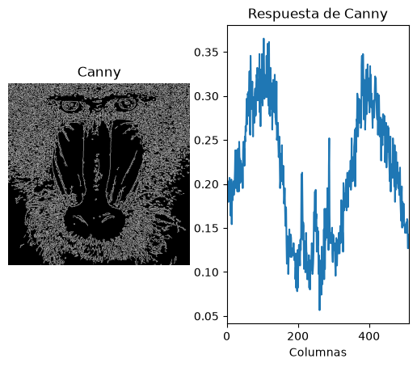
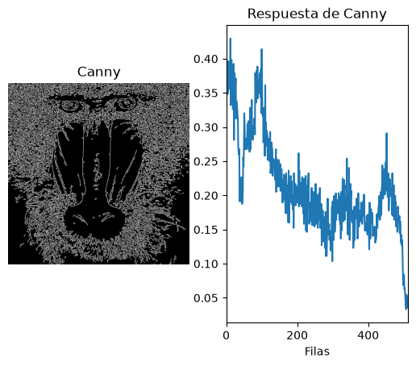
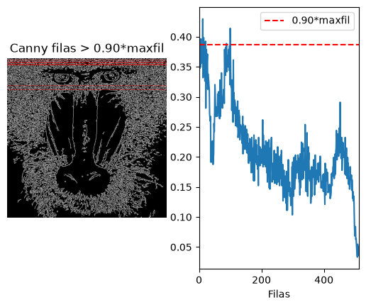
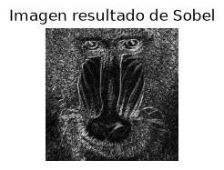
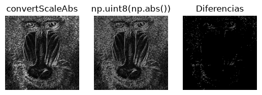
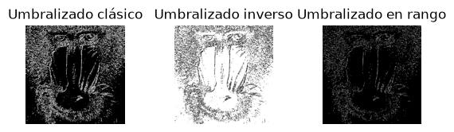
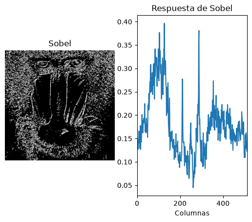
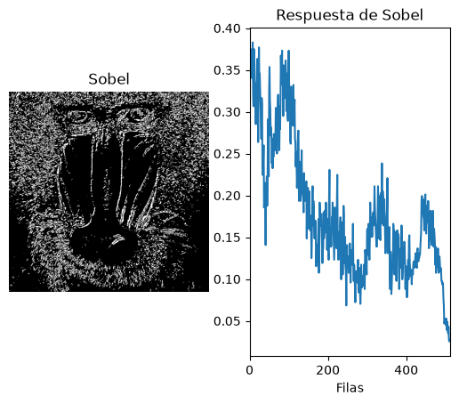
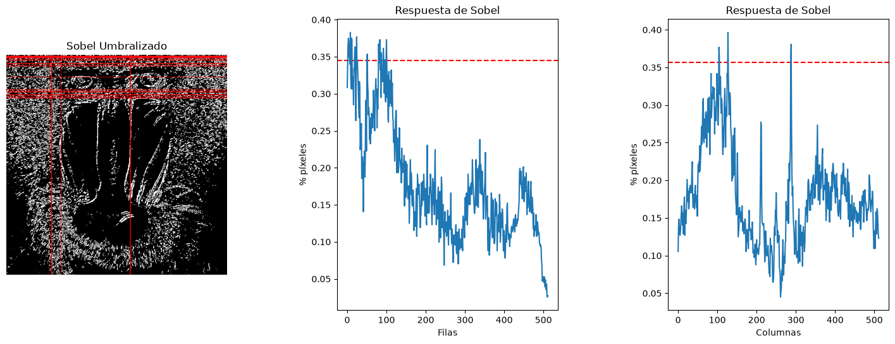
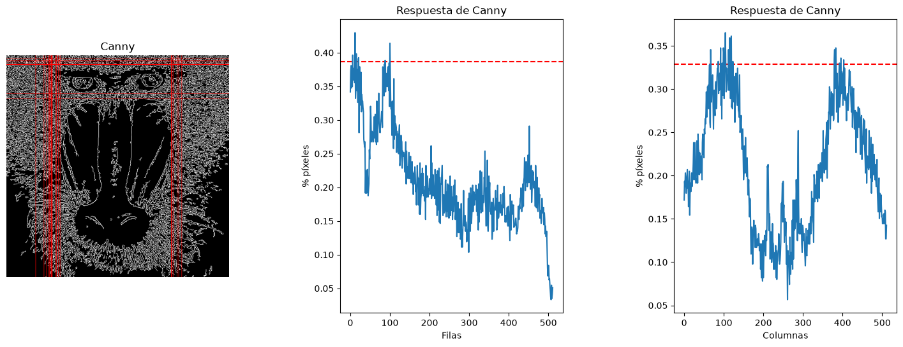

# Práctica 2. Funciones básicas de OpenCV

## Tabla de contenidos
- [Introducción](#introduccion)
- [Pasos previos](#pasos-previos)
- [Tarea 1](#tarea-1)
- [Tarea 2](#tarea-2)
- [Tarea 3](#tarea-3)
- [Fuentes consultadas](#fuentes-consultadas)

## Introducción

En el cuaderno VC_P2 correspondiente a la [segunda práctica de la asignatura](https://github.com/otsedom/otsedom.github.io/tree/main/VC/P2) se proponen una serie de tareas que deben ser completadas. A continuación, se presenta una explicación de las distintas tareas propuestas y como se han resuelto para completarlas con éxito.

## Pasos previos

Para la correcta ejecución del cuaderno, se deberá hacer uso de un _environment_ concreto. En esta ocasión, se usará el mismo _environment_ (VC_P1) que se configuró para la práctica anterior.

## Tarea 1

En esta tarea se plantea realizar la cuenta de píxeles blancos para las filas de la imagen del mandril, de manera análoga a como se realizó para las columnas en el guión de la práctica.

Para ello, en primer lugar se ejecutará y estudiará el código proporcionado.

```
#El contenido de la imagen resultado de Canny, son valores 0 o 255, lo compruebas al descomentar
#print(canny)
#Cuenta el número de píxeles blancos (255) por columna
#Suma los valores de los pixeles por columna
col_counts = cv2.reduce(canny, 0, cv2.REDUCE_SUM, dtype=cv2.CV_32SC1)

#Normaliza en base al número de filas, primer valor devuelto por shape, y al valor máximo del píxel (255)
#El resultado será el número de píxeles blancos por columna
cols = col_counts[0] / (255 * canny.shape[0])

#Muestra dicha cuenta gráficamente
plt.figure()
plt.subplot(1, 2, 1)
plt.axis("off")
plt.title("Canny")
plt.imshow(canny, cmap='gray') 

plt.subplot(1, 2, 2)
plt.title("Respuesta de Canny")
plt.xlabel("Columnas")
plt.ylabel("% píxeles")
plt.plot(cols)
#Rango en x definido por las columnas
plt.xlim([0, canny.shape[1]])
```

<div align="center">



</div>

Una vez se ha comprendido el funcionamiento para las columnas, se procederá a realizar el conteo para el número de filas.

```
# Cuenta el número de píxeles blancos (255) por fila
white_pixels_per_row = cv2.reduce(canny, 255, cv2.REDUCE_SUM, dtype=cv2.CV_32SC1)

# Porcentaje por fila
percentage_per_row = white_pixels_per_row / (255 * canny.shape[1])

# Muestra dicha cuenta gráficamente
plt.subplot(1, 2, 1)
plt.axis("off")
plt.title("Canny")
plt.imshow(canny, cmap="gray")

plt.subplot(1, 2, 2)
plt.title("Respuesta de Canny")
plt.xlabel("Filas")
plt.ylabel("% píxeles")
plt.plot(percentage_per_row)
# Rango en x definido por filas
plt.xlim([0, canny.shape[0]])

plt.show()
```

<div align="center">



</div>

Una vez se ha obtenido la gráfica con el conteo de las filas, se procederá a dibujar con una primitiva gráfica (cv2.line) aquellas que superan el umbral establecido en el enunciado práctica, en este caso de 0.90*maxrows_canny. A continuación, se muestra el código que realiza esta función.

```
maxrows_canny = np.max(white_pixels_per_row)
umbralrows_canny = 0.90 * maxrows_canny
rows_sel_canny = np.where(white_pixels_per_row.flatten() > umbralrows_canny)[0]

# Imagen de Canny en color (BGR) para poder dibujar en rojo
canny_color = cv2.cvtColor(canny, cv2.COLOR_GRAY2BGR)
for f in rows_sel_canny:
    cv2.line(canny_color, (0, int(f)), (canny.shape[1] - 1, int(f)), (0, 0, 255), 1)

# Muestra la imagen resaltada y el plot con el umbral
plt.subplot(1, 2, 1)
plt.axis("off")
plt.title("Canny filas > 0.90*maxfil")
plt.imshow(cv2.cvtColor(canny_color, cv2.COLOR_BGR2RGB))

plt.subplot(1, 2, 2)
plt.xlabel("Filas")
plt.ylabel("% píxeles")
plt.plot(percentage_per_row)
plt.axhline(umbralrows_canny / (255 * canny.shape[1]), color="r", linestyle="--", label="0.90*maxfil")
# Rango en x definido por filas
plt.xlim([0, canny.shape[0]])
plt.legend()

plt.show()
```

<div align="center">



</div>

De esta forma, se puede observar de una manera más simple la situación de aquellas filas que cumplen con el criterio establecido en el enunciado.

## Tarea 2

Con el fin de completar esta tarea, se deberá realizar el umbralizado a la imagen resultante de aplicar Sobel y el conteo de filas y columnas de manera similar a como se hizo anteriormente.

Para ello, se partirá del código proporcionado en el guión de la práctica para obtener la imagen resultado de Sobel.

```
# Gaussiana para suavizar la imagen original, eliminando altas frecuencias
ggris = cv2.GaussianBlur(gris, (3, 3), 0)

#Calcula en ambas direcciones (horizontal y vertical)
sobelx = cv2.Sobel(ggris, cv2.CV_64F, 1, 0)  # x
sobely = cv2.Sobel(ggris, cv2.CV_64F, 0, 1)  # y
#Combina ambos resultados
sobel = cv2.add(sobelx, sobely)

plt.subplot(1, 3, 3)
plt.axis("off")
plt.title('Imagen resultado de Sobel')
#Para visualizar convierte a escala manejable en una imagen de grises
plt.imshow(cv2.convertScaleAbs(sobel), cmap='gray') 
#plt.imshow(sobel, cmap='gray') #Prueba sin convertir escala
plt.show()
```

<div align="center">



</div>

Obtenida la imagen, se deberá convertir a datos de typo _byte_. No obstante, se deberá tener en cuenta que según se use una conversión u otra, esta afectará ligeramente al resultado del conteo de filas y columnas.

```
# Mostrar el tipo de dato de los valores en la imagen soble, además de valores máximo y mínimo
print(f"Tipo de datos, valor mínimo y máximo en sobel: {sobel.dtype}, {np.min(sobel)}, {np.max(sobel)}")

# Conversión a byte con openCV
sobel8 = cv2.convertScaleAbs(sobel)
# Mostrar el tipo de dato de los valores en la imagen soble, además de valores máximo y mínimo
print(f"Tipo de datos, valor mínimo y máximo en sobel8: {sobel8.dtype}, {np.min(sobel8)}, {np.max(sobel8)}")

# Conversión a byte con numpy
sobel8np = np.uint8(np.abs(sobel))
# Mostrar el tipo de dato de los valores en la imagen soble, además de valores máximo y mínimo
print(f"Tipo de datos, valor mínimo y máximo en sobel8np: {sobel8np.dtype}, {np.min(sobel8np)}, {np.max(sobel8np)}")

plt.figure()
plt.subplot(1, 3, 1)
plt.axis("off")
plt.title('convertScaleAbs')
plt.imshow(sobel8, cmap='gray') 

plt.subplot(1, 3, 2)
plt.axis("off")
plt.title('np.uint8(np.abs())')
plt.imshow(sobel8np, cmap='gray') 

plt.subplot(1, 3, 3)
plt.axis("off")
plt.title('Diferencias')
plt.imshow(cv2.absdiff(sobel8,sobel8np), cmap='gray') 

plt.show()
```

<div align="center">



</div>

Tal y como se puede apreciar en la anterior comparativa, existen diferencias ínfimas entre la imagen convertida a _byte_ con _OpenCv_ de aquella que ha sido transformada con _numpy_. Es por ello que se establece que de aquí en adelante se hará uso de la imagen _sobel8np_, es decir, aquella que ha sido convertida con _numpy_.  

Una vez se ha elegido la imagen de Sobel a utilizar, se procederá al proceso de umbralizado de la imagen del mandril.

```
#Define valor umbral
valorUmbral = 100 #Prueba otros valores
#Obtiene imagen umbralizada para dicho valor definido
_, sobelUmbralizado = cv2.threshold(sobel8np, valorUmbral, 255, cv2.THRESH_BINARY)

#El umbralizado inverso, los valores menores que el umbral se muestran en blanco
_, sobelUmbralizadoInverso = cv2.threshold(sobel8np, valorUmbral, 255, cv2.THRESH_BINARY_INV)

#Valores en rango determinado por dos umbrales
imagenEnRango = cv2.inRange(sobel8np, 150, 200)

plt.figure()
plt.subplot(1, 3, 1)
plt.axis("off")
plt.title('Umbralizado clásico')
plt.imshow(sobelUmbralizado, cmap='gray')

plt.subplot(1, 3, 2)
plt.axis("off")
plt.title('Umbralizado inverso')
plt.imshow(sobelUmbralizadoInverso, cmap='gray')

plt.subplot(1, 3, 3)
plt.axis("off")
plt.title('Umbralizado en rango')
plt.imshow(imagenEnRango, cmap='gray')

plt.subplots_adjust(wspace=0.5)

plt.show()
```

<div align="center">



</div>

Una vez se ha finalizado el proceso de umbralizado, se procederá al recuento de filas.

```
#Cuenta el número de píxeles blancos (255) por columna
#Suma los valores de los pixeles por columna
col_counts_sobel = cv2.reduce(sobelUmbralizado, 0, cv2.REDUCE_SUM, dtype=cv2.CV_32SC1)

#Normaliza en base al número de filas, primer valor devuelto por shape, y al valor máximo del píxel (255)
#El resultado será el número de píxeles blancos por columna
cols_sobel = col_counts_sobel[0] / (255 * sobelUmbralizado.shape[0])

#Muestra dicha cuenta gráficamente
plt.figure()
plt.subplot(1, 2, 1)
plt.axis("off")
plt.title("Sobel")
plt.imshow(sobelUmbralizado, cmap='gray') 

plt.subplot(1, 2, 2)
plt.title("Respuesta de Sobel")
plt.xlabel("Columnas")
plt.ylabel("% píxeles")
plt.plot(cols_sobel)
#Rango en x definido por las columnas
plt.xlim([0, sobelUmbralizado.shape[1]])
```

<div align="center">



</div>

Asimismo, se procederá a realizar un procedimiento análogo para obtener las filas.

```
# Obtiene contornos con el operador de Canny
# Parámetros: imagen de entrada, umbral inferior, umbral superior
#canny = cv2.Canny(gris, 100, 200)  # prueba a jugar con umbrales (entre 0 y 255)

# Cuenta el número de píxeles blancos (255) por fila
rows_count_sobel = cv2.reduce(sobelUmbralizado, 255, cv2.REDUCE_SUM, dtype=cv2.CV_32SC1)

# Porcentaje por fila
rows_sobel = rows_count_sobel / (255 * sobelUmbralizado.shape[1])

# Muestra dicha cuenta gráficamente
plt.subplot(1, 2, 1)
plt.axis("off")
plt.title("Sobel")
plt.imshow(sobelUmbralizado, cmap="gray")


plt.subplot(1, 2, 2)
plt.title("Respuesta de Sobel")
plt.xlabel("Filas")
plt.ylabel("% píxeles")
plt.plot(rows_sobel)
# Rango en x definido por filas
plt.xlim([0, sobelUmbralizado.shape[0]])

plt.show()
```

<div align="center">



</div>

Una vez se han obtenido ambas gráficas, se procederá a realizar una comparativa entre las filas y columnas que superan el umbral establecido tanto para Canny como para Sobel. 

```
maxcols_canny = np.max(col_counts)

maxrows_sobel = np.max(rows_count_sobel)
maxcols_sobel = np.max(col_counts_sobel)

print(f"Máximo de filas: {maxrows_sobel}, Máximo de columnas: {maxcols_sobel}")

cols_sel_canny = np.where(col_counts.flatten() > 0.90 * maxcols_canny)[0] # Columnas en el umbral de Canny

rows_sel_sobel = np.where(rows_count_sobel.flatten() > 0.90 * maxrows_sobel)[0]
cols_sel_sobel = np.where(col_counts_sobel.flatten() > 0.90 * maxcols_sobel)[0]

# Imagenés de Canny y Sobel en color (BGR) para poder dibujar en rojo
canny_color = cv2.cvtColor(canny, cv2.COLOR_GRAY2BGR)
sobel_color = cv2.cvtColor(sobelUmbralizado, cv2.COLOR_GRAY2BGR)

for f in rows_sel_canny:
    cv2.line(canny_color, (0, int(f)), (canny.shape[1] - 1, int(f)), (0, 0, 255), 1)

for c in cols_sel_canny:
    cv2.line(canny_color, (int(c), 0), (int(c), canny.shape[0] - 1), (0, 0, 255), 1)

for f in rows_sel_sobel:
    cv2.line(sobel_color, (0, int(f)), (sobelUmbralizado.shape[1] - 1, int(f)), (0, 0, 255), 1)

for c in cols_sel_sobel:
    cv2.line(sobel_color, (int(c), 0), (int(c), sobelUmbralizado.shape[0] - 1), (0, 0, 255), 1)


# Comparativa entre las columnas y filas de Sobel
plt.figure(figsize=(18, 6))

plt.subplot(1, 3, 1)
plt.axis("off")
plt.title("Sobel Umbralizado")
plt.imshow(cv2.cvtColor(sobel_color, cv2.COLOR_BGR2RGB))

plt.subplot(1, 3, 2)
plt.title("Respuesta de Sobel")
plt.xlabel("Filas")
plt.ylabel("% píxeles")
plt.plot(rows_sobel)

plt.subplot(1, 3, 3)
plt.title("Respuesta de Sobel")
plt.xlabel("Columnas")
plt.ylabel("% píxeles")
plt.plot(cols_sobel)

plt.subplots_adjust(wspace=0.5)

plt.show()

# Comparativa entre las columnas y filas de Canny

plt.figure(figsize=(18, 6))

plt.subplot(1, 3, 1)
plt.axis("off")
plt.title("Canny")
plt.imshow(cv2.cvtColor(canny_color, cv2.COLOR_BGR2RGB))

plt.subplot(1, 3, 2)
plt.title("Respuesta de Canny")
plt.xlabel("Filas")
plt.ylabel("% píxeles")
plt.plot(percentage_per_row)

plt.subplot(1, 3, 3)
plt.title("Respuesta de Canny")
plt.xlabel("Columnas")
plt.ylabel("% píxeles")
plt.plot(cols)

plt.subplots_adjust(wspace=0.5)

plt.show()
```

<div align="center">



</div>

<div align="center">



</div>

Tal y como se puede apreciar en las comparativas obtenidas, la situación tanto para Canny como para Sobel es algo similar. No obstante, se puede observar como la presencia de filas y columnas que superan el umbral varía entre ellas.

Para el caso de la imagen procesada con Sobel, se puede notar como existe una mayor presencia de filas por encima del umbral establecido. En cambio, para el caso de las columnas se observa lo contrario: tras realizar la ejecución de Canny se ha obtenido un mayor número de columnas que superan el umbral.

## Tarea 3

## Fuentes consultadas
